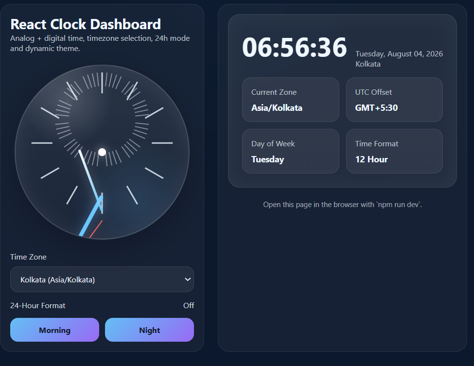
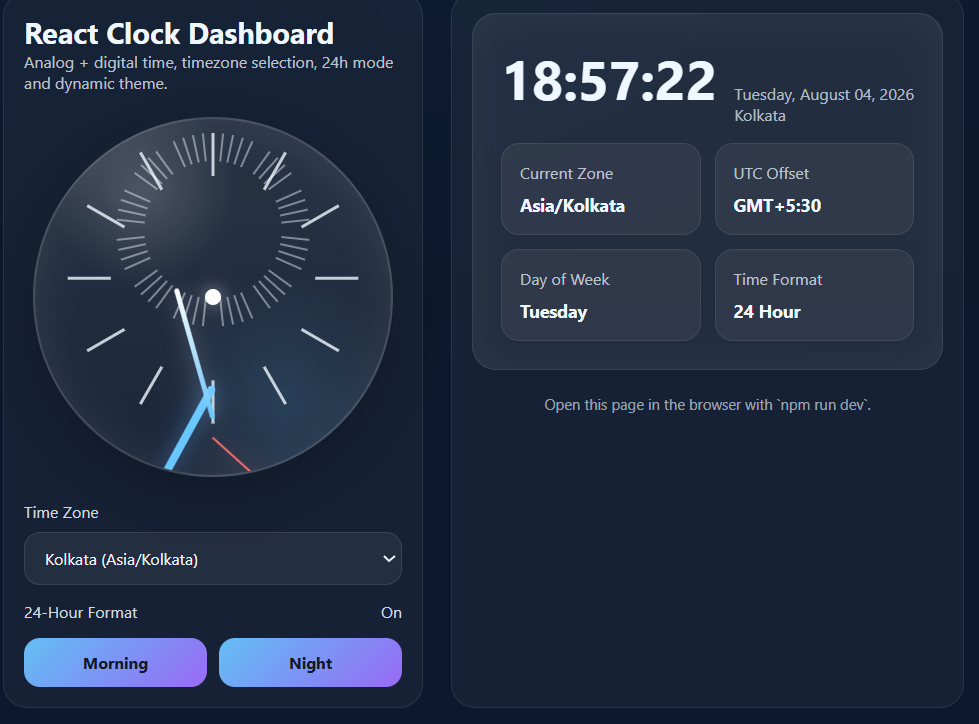

# React Clock Dashboard

A React clock dashboard with analog and digital displays, timezone selection, and 12/24 hour format toggle.

## Features

- Analog clock
- Digital clock
- Timezone selection
- 12-hour / 24-hour mode

## Tech Stack

- React 18
- React DOM
- CSS

## Screenshots

Screenshots show analog and digital clock views, timezone selection, and both 12-hour and 24-hour formats.

